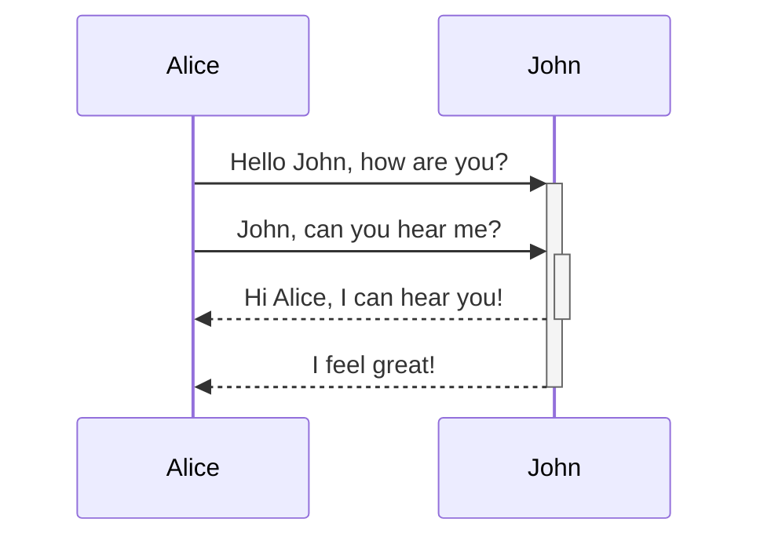

---
{"dg-publish":true,"dg-path":"Help/Formation.md","permalink":"/Help/Formation/","tags":["工具","Markdown"],"noteIcon":"","created":"2024-07-24T14:55:26.164+08:00","updated":"2024-07-28T14:38:16.071+08:00"}
---


## Blockquote（块引用）
```md
> Human beings face ever more complex and urgent problems, and their effectiveness in dealing with these problems is a matter that is critical to the stability and continued progress of society.

\- Doug Engelbart, 1961
```

> Human beings face ever more complex and urgent problems, and their effectiveness in dealing with these problems is a matter that is critical to the stability and continued progress of society.

\- Doug Engelbart, 1961

## Callout（标注、提醒）
As of v0.14.0, Obsidian supports callout blocks, sometimes called "admonitions". Callout blocks are written as a blockquote, inspired by the "alert" syntax from Microsoft Docs.

Callouts are also be supported natively on Obsidian Publish.

> [!NOTE]
> For compatibility reasons, if you're also using the Admonitions plugin, you should update it to at least v8.0.0 to avoid problems with the new callout system.

Use the following syntax to denote a callout block: `> [!tip]`.

```markdown
> [!tip] 
> Here's a callout block.
> It supports **markdown** and [[Internal link\|wikilinks]].
```

It will show up like this:
> [!tip]
> Here's a callout block.
> It supports **markdown** and [[Internal link|wikilinks]].
### Types

By default, there are 12 distinct callout types, each with several aliases. Each type comes with a different background color and icon.

To use these default styles, replace `INFO` in the examples with any of these types. Any unrecognized type will default to the "note" type, unless they are [[4 Archives/Help/Formation#Customizations\|customized]]. The type identifier is case insensitive.
（用于文献笔记）
- note
- abstract, summary, tldr（摘要）
- info（文章中没有的信息）, todo
- tip, hint, important（要点）
- success, check, done
- question, help, faq（遇到的问题）
- warning, caution, attention
- failure, fail, missing
- danger, error（重点）
- bug
- example（文章中举例）
- quote, cite （引用，定义）
> [!DANGER]

> [!WARNING]

> [!EXAMPLE]

> [!BUG]

> [!DONE]

> [!help]

> [!TIP]

> [!ABSTRACT]

> [!def] Definition
> 
> 

> [!note] 

> [!inf]

> [!todo]

> [!quote]

> [!fail]

> [!ques] 

> 这里博客中 callout 的 info 背景颜色错误始终为红色 bug！待调整 #tasks

> [!info] 
### Title and body

You can define the title of the callout block, and you can also have a callout without body content.

```markdown
> [!TIP] Callouts can have custom titles, which also supports **markdown**!
```

### Folding（FAQ折叠功能）

Additionally, you can create a folding callout by adding `+` (default expanded) or `-` (default collapsed) after the block.

```markdown
> [!FAQ]- Are callouts foldable?
> Yes! In a foldable callout, the contents are hidden until it is expanded.
```

Will show up as:

> [!FAQ]- Are callouts foldable?
> Yes! In a foldable callout, the contents are hidden until it is expanded.

### Customizations

Snippets and plugins can define custom callouts, too, or overwrite the default options. Callout types and icons are defined in CSS, where the color is an `r, g, b` tuple and the icon is the icon ID from any internally supported icon (like `lucide-info`). Alternatively, you can specify an SVG icon as a string.

```CSS
.callout[data-callout="my-callout-type"] {
    --callout-color: 0, 0, 0;
    --callout-icon: icon-id;
    --callout-icon: '<svg>...custom svg...</svg>';
}
```

## Code Block（代码块）
Syntax highlight is supported with the language specified after the first set of backticks. We use prismjs for syntax highlighting, a list of supported languages can be found [at their site](https://prismjs.com/#supported-languages)

<pre><code>```js
function fancyAlert(arg) {
  if(arg) {
    $.facebox({div:'#foo'})
  }
}
```</code></pre>
```python
print('Hello')
def test():
	return
```

```js
function fancyAlert(arg) {
  if(arg) {
    $.facebox({div:'#foo'})
  }
}
```


```md
    Text indented with a tab is formatted like this, and will also look like a code block in preview. 
```

    Text indented with a tab is formatted like this, and will also look like a code block in preview. 
## Comment（评论）
Use `You can't see this text%% (Can't see it)

Here is a block comment:
%%
It can span
multiple lines
You can't see this text
It can span
multiple lines
%%

## Diagram（图表）

Obsidian uses [Mermaid](https://mermaid-js.github.io/) to render diagrams and charts. Mermaid also provides [a helpful live editor](https://mermaid-js.github.io/mermaid-live-editor).

<pre><code>```mermaid
sequenceDiagram
    Alice->>+John: Hello John, how are you?
    Alice->>+John: John, can you hear me?
    John-->>-Alice: Hi Alice, I can hear you!
    John-->>-Alice: I feel great!
```</code></pre>



Obsidian supports linking to notes in Mermaid:
<pre><code>```mermaid
graph TD

Biology --> Chemistry

class Biology,Chemistry internal-link;
```</code></pre>

An easier way to do it is the following:
{ #376b9d}

<pre><code>```mermaid
graph TD

A[Biology]
B[Chemistry]

A --> B

class A,B,C,D,E,F,G,H,I,J,K,L,M,N,O,P,Q,R,S,T,U,V,W,X,Y,Z internal-link;
​```</code></pre>

This way, all the note names (at least until `Z[note name]`) are all automatically assigned the class `internal-link` when you use this snippet.

If you use special characters in your note names, you need to put the note name in double quotes.
`"⨳ special character"`
It looks like this if you follow the [[Format your notes#^376b9d\|second option]]:
`A["⨳ special character"]`
## Embeds（嵌入、双链）
Embed another file (read more about [[Embeds\|Embeds]]). Here's an embedded section:

```md
![[Plugins makes Obsidian special for you]]
```

![[Plugins make Obsidian special for you\|Plugins make Obsidian special for you]]
## Emphasis（文字强调）
```md
*This text will be italic*
_This will also be italic_
```

*This text will be italic*
_This will also be italic_

```md
**This text will be bold**
__This will also be bold__
```

**This text will be bold**
__This will also be bold__

```md
_You **can** combine them_
```

_You **can** combine them_

## Footnotes（脚注）
```md
Here's a simple footnote,[^1] and here's a longer one.[^bignote]

[^1]: meaningful!

[^bignote]: Here's one with multiple paragraphs and code.

    Indent paragraphs to include them in the footnote.

    `{ my code }`

    Add as many paragraphs as you like.
```

Here's a simple footnote,[^1] and here's a longer one.[^bignote]

[^1]: meaningful!

[^bignote]: Here's one with multiple paragraphs and code.

    Indent paragraphs to include them in the footnote.
    
    `{ my code }`
    
    Add as many paragraphs as you like.

```md
You can also use inline footnotes. ^[notice that the carat goes outside of the brackets on this one.]
```

You can also use inline footnotes. ^[notice that the carat goes outside of the brackets on this one.]

## Format
Obsidian is a Markdown-based note-taking and knowledge base app. 

We currently support the formats below:

## Heading（标题）
```md
# This is a heading 1
## This is a heading 2
### This is a heading 3 
#### This is a heading 4
##### This is a heading 5
###### This is a heading 6
```

# This is a heading 1
## This is a heading 2
### This is a heading 3 
#### This is a heading 4
##### This is a heading 5
###### This is a heading 6

## HighLight（高亮）
```md
Use two equal signs to ==highlight text==.
```

Use two equal signs to ==highlight text==.

## Horizontal divider（分割线）
```md
Use three stars ***, minuses ---, or underscores ___ in a new line to produce an horizontal bar.
```

---

## Image（图像）
```md

```


#### Resizing images

Example of this above image resized to 200 pixels wide:

```md

```


## Inline Code（内联代码）
```md
Text inside `backticks` on a line will be formatted like code.
```

Text inside `backticks` on a line will be formatted like code. 

## Internal Link（内部链接）
```md
Link to a page: [[Embeds\|Embeds]].
```

Link to a page: [[Embeds]].

## Links
#### External links

Markdown style links can be used to refer to either external objects, such as web pages, or an internal page or image.

```md
http://obsidian.md - automatic!
[Obsidian](http://obsidian.md)
```

http://obsidian.md - automatic!
[Obsidian](http://obsidian.md)

#### Obsidian URI links

Obsidian URI links can be used to open notes in Obsidian either from another Obsidian vault or another program.

For example, you can link to a file in a vault like so (please note the required encoding):

```md
[Link to note](obsidian://open?path=D:%2Fpath%2Fto%2Ffile.md)
```

[Link to note](obsidian://open?path=D:%2Fpath%2Fto%2Ffile.md)

You can link to a note by its vault name and file name instead of path as well:

```md
[Link to note](obsidian://open?vault=MainVault&file=MyNote.md)
```

[Link to note](obsidian://open?vault=MainVault&file=MyNote.md)

#### Escaping

If there are spaces in the url, they can be escaped by either using `%20` as a space, such as:

```md
[Format your notes](Format%20your%20notes)
```

[Format your notes](Format%20your%20notes.md)

Or you can enclose the target in `<>`, such as:

```md
[Format your notes](<Format your notes>)
```

[Format your notes](Format%20your%20notes.md your notes>)

## Lists（列表）
```md
- Item 1
- Item 2
  - Item 2a
  - Item 2b

1. Item 1
1. Item 2
1. Item 3
   1. Item 3a
   1. Item 3b
```

- Item 1
- Item 2
  - Item 2a
  - Item 2b

1. Item 1
1. Item 2
1. Item 3
   1. Item 3a
   1. Item 3b

## Math（数学公式）
```md
$\begin{vmatrix}a & b\\
c & d
\end{vmatrix}=ad-bc$
```

$$\begin{vmatrix}a & b\\
c & d
\end{vmatrix}=ad-bc$$

You can also do inline math like $e^{2i\pi} = 1$ .

Obsidian uses [Mathjax](http://docs.mathjax.org/en/latest/basic/mathjax.html). You can check which packages are supported in Mathjax [here](http://docs.mathjax.org/en/latest/input/tex/extensions/index.html).

## StrikeThrough（划掉）

```md
Any word wrapped with two tildes (like ~~this~~) will appear crossed out.
```

Any word wrapped with two tildes (like ~~this~~) will appear crossed out.

## Table（表格）
You can create tables by assembling a list of words and dividing them with hyphens `-` (for the first row), and then separating each column with a pipe `|`:

```md
First Header | Second Header
------------ | ------------
Content from cell 1 | Content from cell 2
Content in the first column | Content in the second column
```

First Header | Second Header
------------ | ------------
Content from cell 1 | Content from cell 2
Content in the first column | Content in the second column

---

```md
Tables can be justified with a colon | Another example with a long title
:----------------|-------------:
because of the `:` | these will be justified
```

Tables can be justified with a colon | Another example with a long title
:----------------|-------------:
because of the `:` | these will be justified

If you put links in tables, they will work, but if you use Piped Links, the pipe must be escaped with a `\` to prevent it being read as a table element.

```md
First Header | Second Header
------------ | ------------
[[Format your notes\|Formatting]]	|  [[Callouts\|Callouts]]
```

First Header | Second Header
------------ | ------------
[[Format your notes\|Formatting]]	|  [[Callout\|Callouts]]

## Tasks（任务）
```md
- [x] #tags, [links](), **formatting** supported [link](https://todoist.com/app/task/8179077638) #todoist 
- [x] list syntax required (any unordered or ordered list supported) [link](https://todoist.com/app/task/8179077708) 
- [x] this is a complete item [link](https://todoist.com/app/task/8179077788) 
- [?] this is also a complete item (works with every character)
- [ ] this is an incomplete item [link](https://todoist.com/app/task/8179077850) 
- [ ] tasks can be clicked in Preview to be checked off [link](https://todoist.com/app/task/8179077869) 
```

- [x] #tags, [links](), **formatting** supported [link](https://todoist.com/app/task/8179077893) 
- [x] list syntax required (any unordered or ordered list supported) [link](https://todoist.com/app/task/8179077962)
- [x] this is a complete item [link](https://todoist.com/app/task/8179078069) 
- [x] this is also a complete item (works with every character)
- [ ] this is an incomplete item [link](https://todoist.com/app/task/8179078159) 
- [ ] tasks can be clicked in Preview to be checked off [link](https://todoist.com/app/task/8179078195) 